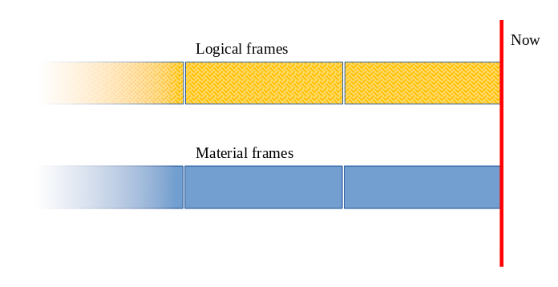
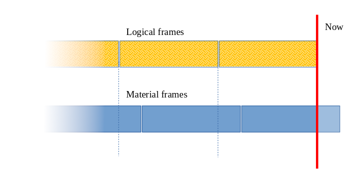

# Sliding Window Counter

We needed a way to have arbitrary short-lived time series. For example, to tackle a messaging spam problem, we would like to know if the number of statistically suspicious messages sent by users connecting from a specific range of IP addresses exceeds previously observed numbers.

We can use a time series built from logs or database entries to work around this. It requires having a log or a database in the first place, not to mention that calculating the necessary statistics on every request could be expensive. We could back the calculation with a cache, but why don't we use the in-memory cache in the first place? That's what we are going for here.

First, we need to solve the input side of the problem. To do that, we divide the time into equal chunks and record events falling into matching periods. And we have to include the observation period and the window size in the cache key to ensure we don't accidentally reuse numbers from another time series. Straightforward as it is.

The slightly more complicated part is to assemble everything back. Let's agree on the following terminology:
- A frame is a window-long period of time.
- The _material frame_ is a frame that matches the data stored in the cache to the last second.
- The _logical frame_ is a window-long frame aligned to the current time but not necessarily aligned to the cache data.

It is all straightforward if the current time is aligned with the material frame boundary. Take what you have in the cache, and presto!



But if logical and material frames are not aligned (the end of the last material frame could be twenty seconds ago, and the logical frame is always now), we are up for some extrapolation.



- To extrapolate the value for the most recent logical frame, we can take a portion of the previous material frame and the full value of the most recent material frame. [This post on Cloudflare's blog explains it beautifully.](https://blog.cloudflare.com/counting-things-a-lot-of-different-things/)
- And we use portions of underlying material frames for every other logical frame.

And there are many edge cases: for example, if we don't specify the anomaly detection start time, we discard all heading null values. But for relatively rare events, it might make sense to keep every empty frame, so there's an option to specify the start time.

# The API

Here's how it should be used:

```php
// Configure a counter to work in hourly buckets, for the last 24 hours
// and using the Memcached adapter.
$counter = new \Automattic\SlidingWindowCounter\SlidingWindowCounter(
    'my-counters',
    3600,
    3600 * 24,
    new \Automattic\SlidingWindowCounter\Cache\MemcachedAdapter($memcached)
);

// Increment the counter when a certain event happens.
$counter->increment($_SERVER['REMOTE_ADDR']);
```

And at some later point in time

```php
// Try to detect an anomaly.
$anomaly_result = $counter->detectAnomaly($_SERVER['REMOTE_ADDR']);
if ($anomaly_result->isAnomaly()) {
    // Inspect the result using the toArray() method.
    $anomaly_result->toArray();

    // Or individual accessors.
    $anomaly_result->getMean();
    $anomaly_result->getStandardDeviation();
    // ...
}

// And explore the historic variance...
$variance = $counter->getHistoricVariance($_SERVER['REMOTE_ADDR']);
// ...using various accessors.
$variance->getCount();
$variance->getMean();
$variance->getStandardDeviation();
```

There's also a handy adapter for the Memcached-backed `WP_Object_Cache`:

```php
$counter = new \Automattic\SlidingWindowCounter\SlidingWindowCounter(
    'my-counters',
    3600,
    3600 * 24,
    new \Automattic\SlidingWindowCounter\Cache\WPCacheAdapter($wp_object_cache)
);
```
